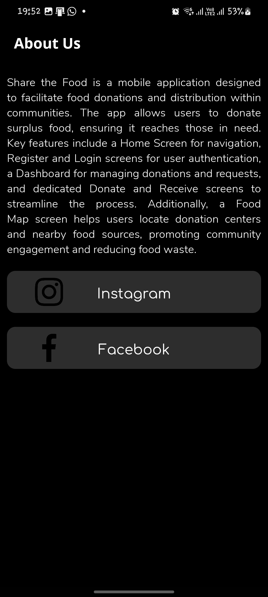

---

# Share the Meal

Share the Meal is a community-driven app designed to make it easier to donate, receive food, and locate food resources on a map. Our mission is to connect people in need with those willing to help through a simple and intuitive platform.


## Table of Contents

- [Features](#features)
- [Screenshots](#screenshots)
  - [Integrated Database with Firebase](#integrated-database-with-firebase)
  - [Main Dashboard](#main-dashboard)
  - [Donate Section](#donate-section)
  - [Receive Section](#receive-section)
  - [Food Map](#food-map)
  - [My Pins Section](#my-pins-section)
  - [History Section](#history-section)
  - [Contact Section](#contact-section)
  - [Login and Sign Up Major Dashboard](#login-and-sign-up-major-dashboard)
  - [Login Section](#login-section)
  - [Sign Up Section](#sign-up-section)
  - [About Us Section](#about-us-section)
- [Installation](#installation)
- [Usage](#usage)
- [Contributing](#contributing)
- [License](#license)

## Features

- Easy-to-use interface for donating and receiving food
- Real-time updates and notifications
- Integrated with Firebase for seamless data management
- Interactive food map with pins for food resources
- User account management and history tracking
- Contact section for user support and inquiries

## Screenshots

### Integrated Database with Firebase

Description: This section demonstrates the integration of the app's database with Firebase, showcasing real-time data synchronization.

### Main Dashboard

Description: The main dashboard provides an overview of the app's features and quick access to various sections.

### Donate Section

Description: The donate section allows users to contribute food items easily.

### Receive Section

Description: The receive section enables users to request food items and see available donations.

### Food Map

Description: An interactive map showing the location of food resources with pins for easy navigation.

### My Pins Section

Description: This section displays the user's pins on the food map, marking their favorite or frequently visited resources.

### History Section

Description: The history section tracks the user's past donations and received items.

### Contact Section

Description: A contact form for users to reach out for support or inquiries.

### Login and Sign Up Major Dashboard

Description: The major dashboard for user authentication, including options to log in or sign up.

### Login Section

Description: The login form for existing users to access their accounts.

### Sign Up Section

Description: The registration form for new users to create an account.

### About Us Section

Description: Information about the mission and team behind the Share the Meal app.

## Installation

1. Clone the repository:
   ```sh
   git clone https://github.com/yourusername/share-the-meal.git
   ```

2. Navigate to the project directory:
   ```sh
   cd share-the-meal
   ```

3. Install dependencies:
   ```sh
   npm install
   ```

4. Set up Firebase:
   - Go to the Firebase console and create a new project.
   - Add your web app to the Firebase project and copy the configuration details.
   - Replace the placeholder configuration in the `firebaseConfig.js` file with your Firebase configuration.

5. Run the app:
   ```sh
   npm start
   ```

## Usage

- Register for an account or log in if you already have one.
- Navigate through the app using the main dashboard.
- Use the donate and receive sections to contribute or request food.
- Check the food map for nearby resources and add your pins.
- Track your activity in the history section.
- Contact support through the contact section if needed.

## Contributing

Contributions are welcome! Please fork the repository and submit a pull request with your changes.

## License

This project is licensed under the MIT License. See the [LICENSE](LICENSE) file for more details.

---
